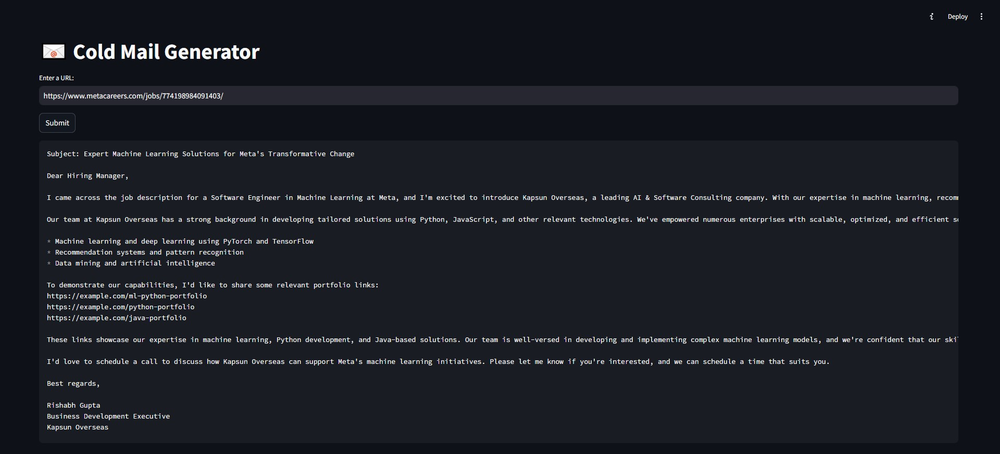
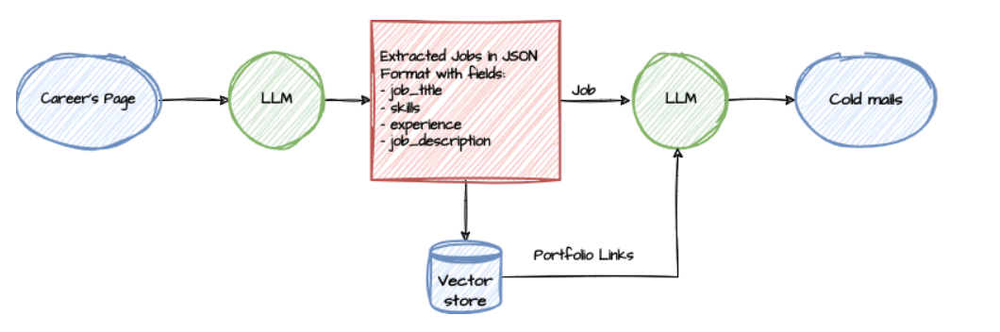

# 📧 Cold Mail Generator  
Cold email generator for services company using Groq, LangChain, and Streamlit. It allows users to input the URL of a company's careers page. The tool then extracts job listings from that page and generates personalized cold emails. These emails include relevant portfolio links sourced from a vector database, based on the specific job descriptions.  

**Imagine a scenario:**  

- Meta needs a Software Engineer in Machine Learning and is spending time and resources in the hiring process, onboarding, training, etc.  
- Kapsun Overseas, a software development company, can provide a dedicated software development engineer to Meta. So, the business development executive (Rishabh Gupta) from Kapsun Overseas is going to reach out to Meta via a cold email.  

  

## 🚀 Live Deployment  
The app is now **deployed on Render!**   
You can try it out here, just paste a job link :  

🔗 **[Cold-Email-Generator-App](https://cold-email-generator-project.onrender.com)**  

_(Note: Since it's hosted on Render's free tier, it may take some time to load initially and respond.)_  

## 🏗️ Architecture Diagram  
  

## ⚙️ Set-up  

1. Get an API key from **[Groq](https://console.groq.com/keys)**. Inside `app/.env`, update the value of `GROQ_API_KEY` with the API key you created.  

2. Install dependencies:  
   ```sh
   pip install -r requirements.txt
